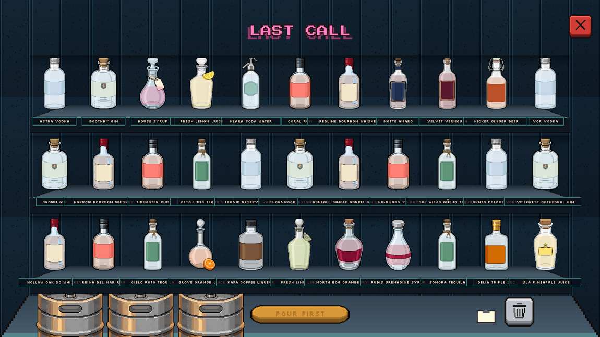
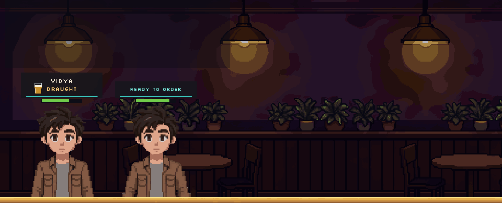
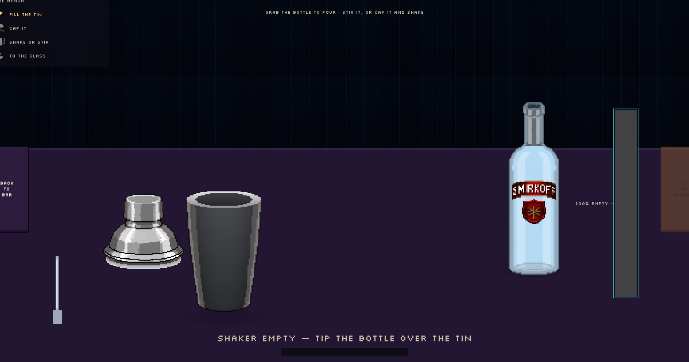
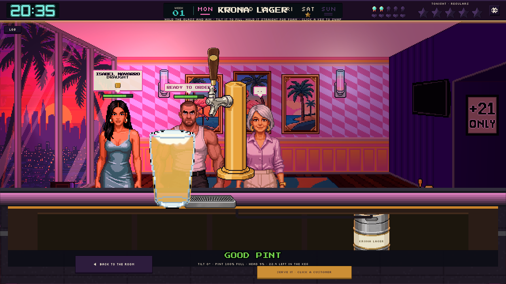
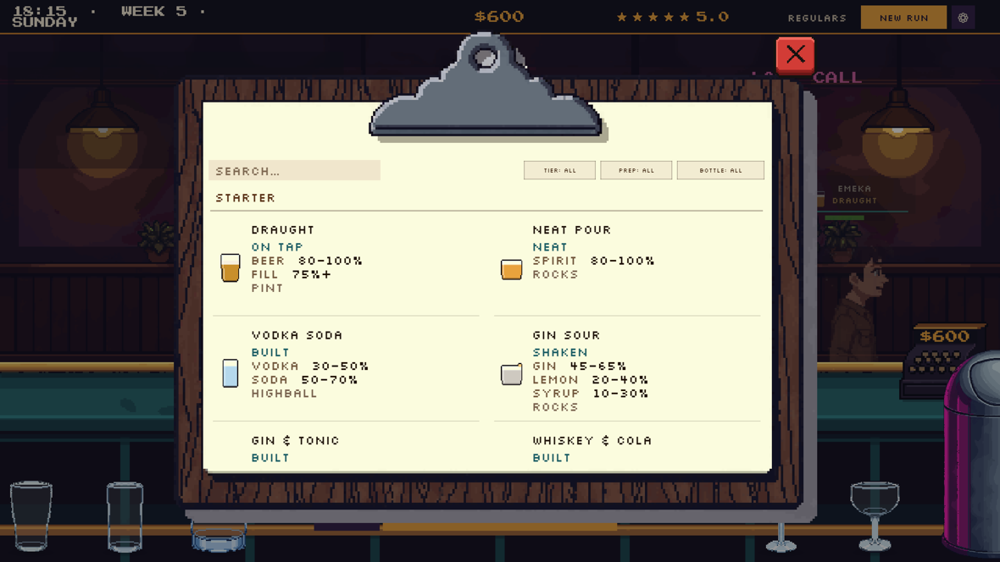
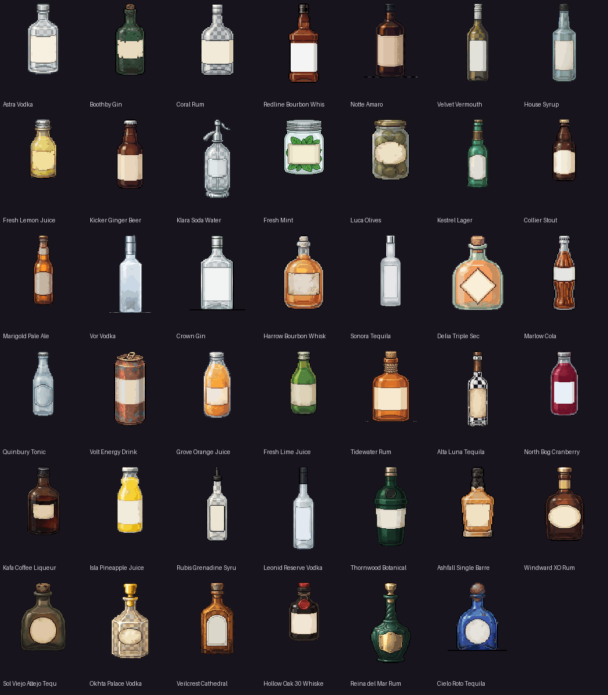

# LAST CALL

> *Last call. What are you having?*

A bar-tycoon about **reading the person in front of you** and running the till, set in a
neon-lit late-night cocktail bar. Customers walk in, sit down, and keep their order to
themselves: **you cannot see what they want until you ask for their ID.** Reading the card
takes the order — there is no going back. Then you build the drink with real hands-on
physics — pour, stir, shake, pull a pint — serve it, and live on the tips. Rent falls due
every night. Three nights in the red and the bar is gone. Five stars is the long game.

**Engine:** Unity 6000.3.10f1 (URP) · **Platform:** PC
**Status:** the tycoon loop is playable end to end and measured by a simulation bot. The
scripted "last customer" story beat plays in the scene; its closing-light presentation and
arc rewards are the active work.

---

## The night

A night lasts 95 real seconds (the clock shows 18:00 → 02:00). The week is six nights,
Tuesday through Sunday — Monday the bar is dark. At closing the door shuts, whoever is
seated finishes their drink, rent is deducted automatically, and the market rerolls.
Rent grows every day (`12 + 2·day + day²/9` — about $136 by day 24), so a bar that
doesn't grow, drowns. Close **three consecutive days** with negative cash and the run
ends; one clean day resets the counter.

## The card

The order is hidden information, enforced in code: `CustomerVisit.Order` **throws** until
`InspectId()` is called, and only the core rules layer can see past it. Clicking a stool
shows the ID — that's the moment you take the order, and the customer's drink-patience
clock starts. Serving blind is legal; the judge simply compares what you delivered against
the truth you never looked at.

Every customer runs one clock, from the moment they decide to the moment the drink lands:
being left un-asked spends it exactly as waiting on the drink does (a walk-out is a
storm-out that still scars your rating), and reading the ID pays one of its three boxes
back — never a reset. Nail an exact order with full craft and a returning customer may ask
for an extra round.

## The drink — three ways, one law

**The brim law:** no vessel in the game can overflow. A pour stops at the brim; waste is
always a deliberate act (the bin has a price).

- **The shaker** builds every drink except beer. Grab the bottle, tip it over the tin —
  the stream leaves the bottle's actual measured mouth — stir with the spoon in the open
  tin, or cap it and shake. Recipes dictate the method: a *Shaken* recipe demands the
  shake, a *Stirred* one demands the spoon, and serving a shaken Martini is legal but it
  shows up in the tip.
- **Built in glass** — the simple route for highballs, judged the same.
- **The tap** pours beer and only beer. Tilt the glass to fill, straighten it to raise the
  head; 45° is the ideal angle, upright pouring is nearly all foam. The craft of a pint
  *is* its head — the good band is 8–20%, ideal 14%. Kegs live in a real cellar under the
  counter; click one to couple it to the line.

The serving pour is part of the skill: a drink cannot be served from the shaker — you aim
the pour into the glass, and what misses the glass is gone (ratios stay honest). The glass
picks itself: the first pour-out selects the matched recipe's glassware.

## The money

The base price of a drink is deliberately low ($4–17). **Tips are the real income**, and
the tip is a straight read of your work: `base × quality`, where quality is
**45% speed + 35% craft + 20% fill**. Craft on a cocktail is garnish-spec plus using the
method the *ordered* recipe asked for; craft on a pint is the head. The right drink at the
wrong ratio lands as a **Close** — menu price, half the tip. The wrong drink earns the
price of whatever you actually handed over, and no tip at all.

Money leaves through rent, restocks, new bottles and recipes, extra stools, glassware
tiers, counter upgrades and the trash. Snacks are a side hustle with morning buy-back.

## The stars

The bar starts at 0★. Each night scores a star value from customer satisfaction, but two
caps clip it: an **upgrade cap** (glassware and stools) and a **menu cap** (the best exact
order you actually served that night). Progress has inertia — climbing is slower than
falling. The crowd follows the rating: a high bar pulls HighRollers (×1.25 wallets), a
sinking one pulls Brokes. Recipe ranks gate on stars too: ranks 9–14 need 2★, 15–21 need
3★, 22+ need 4★ — so the stars, the menu and the money keep forcing each other's hand.

## The recipe book

54 recipes (19 built, 22 shaken, 13 stirred) across five glass lines. Four are live on day
one — draught, the neat pour, vodka soda, gin sour — the rest are bought from the market.
Cocktails are **style-banded** (gin is not vodka), five of them demand a minimum bottle
tier (a well-gin Vesper reads as "less"), and the book shows every spec with search and
tier/prep/bottle filters.

The bar stocks a cast of **41 parody bottles** (30 live, 11 locked behind market finds) —
Smirkoff, John Wanderer, Maliboo and friends — from $1 well vodka up to tier-4 shelf
trophies that quietly raise what every drink using them can charge.

## The last customer

After close, on story nights, one more guest is seated — the scripted closing beat
(GDD module 26). They are the house's guest: no ID (they introduce themselves — the one
written exception to the hidden-order rule), no bill, no tip, no score. What they bring is
a **trial**: a few drinks, one clock, full spec and full craft demanded, and a night that
burns if you miss too often. Story is opt-in data (`story/story.json`); a run without a
`StoryArc` plays exactly as before.

---

## Quickstart

1. Open the project in Unity **6000.3.10f1** (or a compatible 6000.3.x editor).
2. Open [Main.unity](Assets/Scenes/Main.unity) and press **Play**.
3. **Click a stool** to read the ID — this takes the order.
4. Open the **MENU** (the back bar) and click a bottle — it routes itself: beer to the
   tap, carbonated to the serving glass, everything else to the shaker, garnish straight
   into the tin.
5. Build the drink, pour it out, dress it (ice / lemon / salt / sugar at the serve bench),
   then **drag the glass onto the customer's stool**.

Around the room: click a dirty glass to collect it, drag a drink to the trash to bin it
(it costs), click the bowl to run snacks, and the till shows tonight's take. At day's end
the receipt leads into the market — restock, bottles, recipes, upgrades, with same-night
refunds. **NEW RUN** lives in the settings panel; seeds are deterministic, so the same
seed string replays the same run on any platform.

If the scene ever breaks, rebuild it from the **LastCall → Create Debug Scene** menu item.

> **Cloning note:** binary assets (art, audio, test baselines) are stored in **Git LFS** —
> run `git lfs pull` after cloning. The images in this README are plain blobs on purpose,
> so they render on GitHub.

## Verifying changes

Two suites, both green before any push:

- **EditMode** (`LastCall.Tests`) — 300+ tests across 15 suites: recipe matching and
  parity, pour/tap physics, scoring, economy, star track, determinism, data validation,
  the hidden-information boundary, and the last-customer trial.
- **PlayMode** (`LastCall.PlayTests`) — a **virtual mouse plays the real scene**: the bar
  opens and deals a night, a stool answers the pointer, a bottle takes the bench, the
  bottle pours into the tin. On top of that, `LookTests` compares whole screens **pixel
  for pixel** against blessed baselines in `Assets/Tests/PlayMode/Baselines~/` (the back
  bar, the bench, the market's basket foot, the closing beat). When a screen is *meant* to
  change: **LastCall → Re-bless UI Baselines**, then run twice. Baselines are
  machine-local by design and stay out of CI.

## Balance

**LastCall → Simulate Tycoon 200 Runs** batch-plays seeded runs through the real
`TycoonRun` with a bot that uses the same verbs the player does — it reads IDs, mixes,
pulls pints leaned-then-straightened, and never shops. Results land in
[tycoon_sim_report.md](Docs/tycoon_sim_report.md). Its survival rate is a **floor**, not a
prediction; trust the shape comparisons. The harness has already caught two design bugs
and two reporting bugs — measure, don't guess.

## Architecture

Boundaries are enforced by assembly definitions, not convention:

| Path | Assembly | Purpose |
|---|---|---|
| [Assets/Scripts/Core/](Assets/Scripts/Core/) | `LastCall.Core` | **Pure C#, `noEngineReferences: true`.** All game rules: the run, service, pours, tap physics, matching, judging, economy, stars, story. |
| [Assets/Scripts/Game/](Assets/Scripts/Game/) | `LastCall.Game` | Unity glue: `DataLoader` (JSON → Core with loud validation), bootstrap. |
| [Assets/Scripts/UI/](Assets/Scripts/UI/) | `LastCall.UI` | The whole game UI, built in code — no prefabs. Scene art at 640×360 pixel-perfect, HUD at 1280×720. |
| [Assets/Scripts/Editor/](Assets/Scripts/Editor/) | `LastCall.Editor` | The **LastCall** menu: scene builder, simulator, baseline tools. |
| [Assets/Tests/EditMode/](Assets/Tests/EditMode/) | `LastCall.Tests` | EditMode suites. |
| [Assets/Tests/PlayMode/](Assets/Tests/PlayMode/) | `LastCall.PlayTests` | Virtual-mouse smoke tests + pixel look tests. |

Four rules hold it together (working detail in [CLAUDE.md](CLAUDE.md)):

- **Core stays pure.** No `UnityEngine` types in `LastCall.Core` — the asmdef makes it
  impossible. `TapPour`, `ServiceJudge`, `RatioRecipeMatcher` all decide without a
  `MonoBehaviour` in sight.
- **The rules layer never trusts the UI.** If something must not happen, Core refuses it.
  The sim bot and the tests speak the same verbs as the player, so a hole shows up as a
  wrong balance number, not a bug report.
- **Content is data.** Bottles, recipes, glassware, archetypes, fixtures and the story
  cast live in [Assets/Data/](Assets/Data/) as JSON. `RecipeCatalog` (code) and
  `recipes.json` are held together by a parity test.
- **Determinism.** All randomness flows through `RunRng` named streams (custom PCG32) —
  `arrivals`, `orders`, `patience`, `customer`, `read`, `decide`. A seed string reproduces
  an identical run on every platform.

And the one that guards the game's heart: **hidden information stays hidden.** Nothing
outside Core may see an order before the ID is read — the boundary is enforced by a throw,
and by tests.

## Design docs

- **[GDD_MEVCUT.md](Docs/GDD_MEVCUT.md)** — the as-built rulebook, extracted from code
  with file:line evidence. For any live rule, this wins.
- [Docs/GDD/](Docs/GDD/) — the design modules: **23–24** own the tycoon loop and service
  presentation, **21** the pour system (§10 draught), **22** bottles/brands/market,
  **26** the last-customer story; 14–16 and 18 carry the art bible, asset pipeline, UI
  style guide and stage spec; 25 is the bottle-art brief for an external artist.
- [PLAN_service_depth.md](Docs/PLAN_service_depth.md) — the staging document and conflict
  ledger; [PLAN_last_call.md](Docs/PLAN_last_call.md) — the story beat's phase log.
- [GELISTIRME_RAPORU.md](Docs/GELISTIRME_RAPORU.md) — standing audit and prioritized
  backlog.

*(A portion of the design docs is written in Turkish — the code, tests and data are all
English.)*
